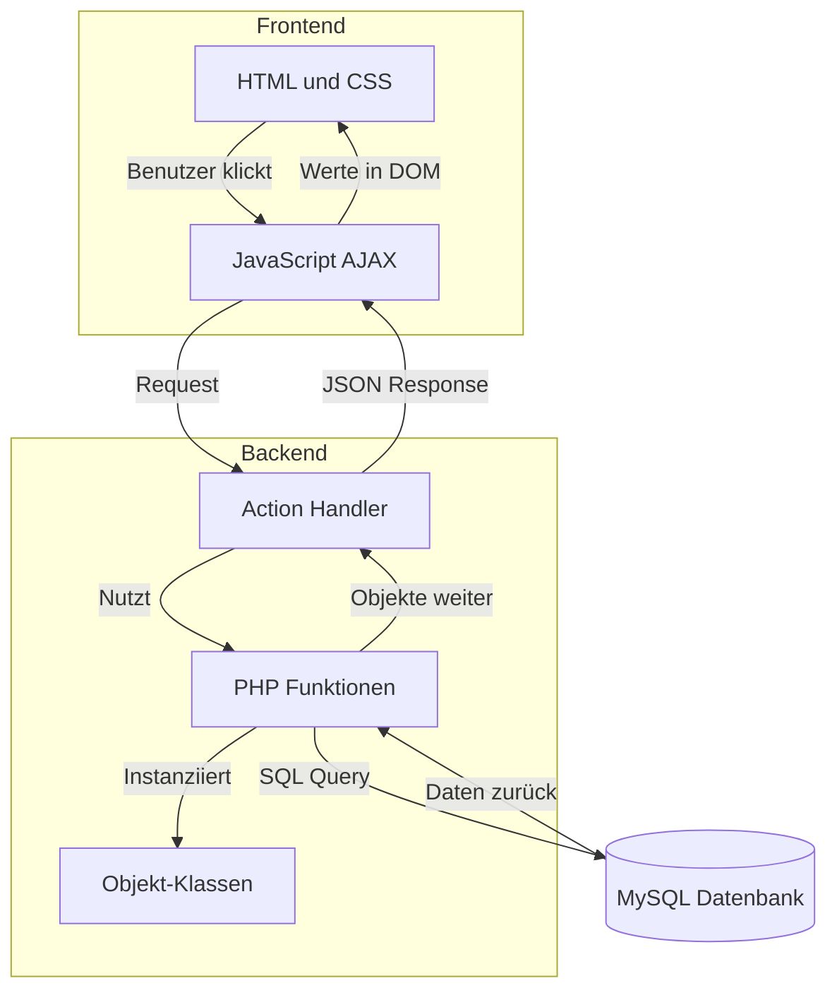

# ⚽ Tippspiel Kulowcup


## 📝 Inhaltsverzeichnis
- [⚽ Tippspiel Kulowcup](#-tippspiel-kulowcup)
  - [📝 Inhaltsverzeichnis](#-inhaltsverzeichnis)
  - [📝 Beschreibung](#-beschreibung)
  - [📁 Projektstruktur \& Architektur](#-projektstruktur--architektur)
  - [🧠 Logischer Programmaufbau (Architektur)](#-logischer-programmaufbau-architektur)
  - [🚀 Installation (für Einsteiger mit XAMPP unter Windows)](#-installation-für-einsteiger-mit-xampp-unter-windows)
  - [🤝 Mitwirken](#-mitwirken)

Ein webbasiertes Fußball-Tippspiel für den Kulowcup, entwickelt mit PHP, HTML, CSS und JavaScript.

## 📝 Beschreibung

Dieses Projekt ermöglicht es Benutzern, an einem Fußball-Tippspiel teilzunehmen, Spielergebnisse vorherzusagen und Punkte basierend auf der Genauigkeit ihrer Tipps zu sammeln. Es bietet eine benutzerfreundliche Oberfläche und eine einfache Möglichkeit, den Wettbewerb zu verfolgen.

## 📁 Projektstruktur & Architektur

Das Projekt folgt einer klaren, modularen Struktur. Um die Wartbarkeit zu garantieren, sind Frontend (Design/HTML), Backend-Logik (PHP) und externe Skripte strikt getrennt.

### 📂 Die Ordner- und Dateistruktur

* **`index.php`**: Der zentrale Einstiegspunkt (Router/Weiterleitung) zur Startseite.
* **`css/`**: Beinhaltet alle globalen Stylesheets.
* **`data/`**: Speicherort für statische Medien wie Team-Logos und Platzhalter-Bilder.
* **`DB/`**: Enthält die SQL-Dumps zum initialen Aufsetzen der Datenbankstruktur.
* **`script/`**: Das "Herz" der lokalen Abhängigkeiten. Hier liegt die `db_connection.php` (für den Datenbankaufbau via PDO) sowie alle wichtigen, lokal gehosteten JavaScript-Bibliotheken (wie `jquery-3.6.0.min.js` und `chart.js`), damit das System auch ohne Internetverbindung autark lauffähig ist.
* **`html/`**: Hier liegt das eigentliche Frontend. Für jede Unterseite (z.B. `/tippen` oder `/statistik`) gibt es einen eigenen Ordner, der strikt folgendem Muster folgt:
  * `[seitenname].php`: Lädt Header, Menü und Footer und bindet den eigentlichen Inhalt ein.
  * `[seitenname]_content.php`: Enthält das reine HTML-Gerüst der jeweiligen Seite.
  * `[seitenname].js`: Das seitenspezifische JavaScript, welches via AJAX/Fetch mit dem Backend kommuniziert.
* **`html/spiele_backend.php`**: Die zentrale Backend-API. Alle Frontend-Skripte rufen diese Datei auf, um Daten zu lesen oder zu schreiben.

---

## 🧠 Logischer Programmaufbau (Architektur)

Die Anwendung nutzt eine client-server-basierte Architektur. Das Frontend (Browser) kommuniziert asynchron mit der zentralen Backend-Datei (`spiele_backend.php`), welche wiederum die Datenbank abfragt. Im Backend selbst wird strikt zwischen Datenmodellen (Klassen), Hilfsfunktionen und dem API-Routing (Action-Handler) getrennt.



## 🚀 Installation (für Einsteiger mit XAMPP unter Windows)

### 1. XAMPP herunterladen und installieren

* Lade XAMPP für Windows von [SourceForge](https://sourceforge.net/projects/xampp/files/) herunter.
  **Tipp:** Die portable Version ist besonders einsteigerfreundlich.
* Entpacke das Archiv in einen Ordner, z. B. `C:\xampp`.
* Führe im entpackten Ordner die Datei `setup_xampp.bat` aus.
* Warte, bis die Einrichtung abgeschlossen ist.

### 2. XAMPP starten

* Öffne `xampp-control.exe`.
* Starte **Apache** und **MySQL** durch Klick auf „Start“.

### 3. Datenbank und Benutzer einrichten

1. **phpMyAdmin öffnen:**
   Rufe im Browser [http://localhost/phpmyadmin](http://localhost/phpmyadmin) auf.

2. **Datenbank anlegen:**

   * Klicke auf **„Datenbanken“**.
   * Erstelle eine neue Datenbank mit dem Namen `tippspiel`.

3. **Benutzer anlegen:**

   * Gehe zum Reiter **„Benutzerkonten“**.
   * Klicke auf **„Benutzerkonto hinzufügen“**.
   * Benutzername: `webserver`
   * Hostname: `localhost`
   * Passwort: `47114711`
   * Passwort wiederholen: `47114711`
   * Weise dem Benutzer **alle Rechte** für die Datenbank `tippspiel` zu.
   * Klicke auf **„OK“**.

4. **Datenbankstruktur importieren:**

   * Wähle links die Datenbank `tippspiel` aus.
   * Klicke oben auf **„Importieren“**.
   * Wähle die SQL-Datei aus dem Ordner `DB/` deines Projekts.
   * Klicke auf **„OK“**, um die Tabellen zu importieren.

### 4. Projektdateien einfügen

* Klone dieses Repository in den `htdocs`-Ordner von XAMPP (z. B. `C:\xampp\htdocs`):

```bash
git clone https://github.com/M-0-K/Tippspiel_Kulowcup.git
```

* Alternativ kannst du das Projekt auch als ZIP-Datei herunterladen und manuell entpacken.

### 5. Weiterleitung anpassen (optional, aber empfohlen)

Wenn du möchtest, dass beim Aufruf von `http://localhost` direkt dein Tippspiel geöffnet wird, kannst du die `index.php` im `htdocs`-Verzeichnis wie folgt anpassen:

```php
<?php
	if (!empty($_SERVER['HTTPS']) && $_SERVER['HTTPS'] === 'on') {
		$uri = 'https://';
	} else {
		$uri = 'http://';
	}
	$uri .= $_SERVER['HTTP_HOST'];
	header('Location: ' . $uri . '/Tippspiel_Kulowcup/index.php');
	exit;
?>
```

### 6. Anwendung im Browser öffnen

* Starte deinen Browser und öffne die Adresse:

```
http://localhost/
```

Die Anwendung sollte nun geladen werden. Falls Fehler auftreten, überprüfe die Zugangsdaten in deiner PHP-Datei (DSN, Benutzername und Passwort) sowie die MySQL-Einstellungen.

---

## 🤝 Mitwirken

Beiträge sind willkommen! Wenn du Verbesserungen vorschlagen oder Fehler melden möchtest, eröffne bitte ein [Issue](https://github.com/M-0-K/Tippspiel_Kulowcup/issues) oder erstelle einen Pull Request.

